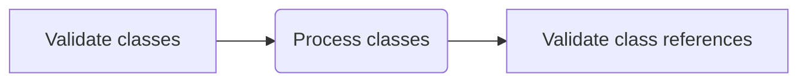

# Architecture

The [ResourceTransformer][docx4j_xsdata.codegen.transformer.ResourceTransformer] is the
orchestrator of the code generation procedure.


## Load Resource

The code generator accepts URIs indicating either local or remote file locations.

The resource type (xsd, wsdl, dtd, xml, json) is identified based on the file extension,
if present. If the resource lacks an extension, the loader will attempt to locate
specific syntax markings associated with the resource type.

If a resource cannot be accessed, a warning is issued, and the program continues its
normal flow. In the case of circular imports, resources are loaded only once.

## Parse transfer objects

A resource-specific parser is utilized to bind document information to transfer objects.
Additionally, the parsers are responsible for assigning common values required for later
analysis, such as locations, a namespace prefix-URI map, and common namespaces like xsi
and xlink.

- XSD: [SchemaParser][docx4j_xsdata.codegen.parsers.SchemaParser]
- DTD: [DtdParser][docx4j_xsdata.codegen.parsers.DtdParser]
- WSDL: [DefinitionsParser][docx4j_xsdata.codegen.parsers.DefinitionsParser]
- XML: [TreeParser][docx4j_xsdata.formats.dataclass.parsers.TreeParser]
- JSON: [json.loads][]

## Convert to classes

A resource-specific parser is utilized to convert the transfer objects to codegen
classes. These mappers encapsulate the pertinent logic detailing how the resource types
should be interpreted.

- XSD: [SchemaMapper][docx4j_xsdata.codegen.mappers.SchemaMapper]
- DTD: [DtdMapper][docx4j_xsdata.codegen.mappers.DtdMapper]
- WSDL: [DefinitionsMapper][docx4j_xsdata.codegen.mappers.DefinitionsMapper]
- XML: [ElementMapper][docx4j_xsdata.codegen.mappers.ElementMapper]
- JSON: [DictMapper][docx4j_xsdata.codegen.mappers.DictMapper]

## Analyze classes



### Validate Classes

- Remove types with unknown references

```xml
<xs:element name="root" ref="xs:missingOrUnknown"/>
```

- Remove duplicate types: Keep the last definition

```xml
<xs:element name="root" ref="RootType"/>
<xs:element name="root" ref="RootType"/>
```

- Remove duplicate overridden types:

```xml
<xs:override schemaLocation="over005a.xsd">
    <xs:attribute name="code" type="xs:date"/>
</xs:override>
```

- Merge redefined types:

```xml
<xs:redefine schemaLocation="schZ006.xsd">
    <xs:group name="GCustomDimProps">
        <xs:sequence>
            <xs:element name="DisplayInfo"	type="xs:unsignedInt"/>
        </xs:sequence>
    </xs:group>
</xs:redefine>
```

API: [docx4j_xsdata.codegen.validator.ClassValidator][]

### Analyze Classes

The classes are wrapped in a [ClassContainer][docx4j_xsdata.codegen.container.ClassContainer]
instance. It includes some easy finder methods and orchestrates flattening/filtering
processes.

The process is divided into multiple steps and handlers per step. All classes have to
pass through each step before next one starts. The order of the steps is very important!

### Step: Ungroup

- [FlattenAttributeGroups][docx4j_xsdata.codegen.handlers.FlattenAttributeGroups]

### Step: Flatten

- [CalculateAttributePaths][docx4j_xsdata.codegen.handlers.CalculateAttributePaths]
- [FlattenClassExtensions][docx4j_xsdata.codegen.handlers.FlattenClassExtensions]
- [SanitizeEnumerationClass][docx4j_xsdata.codegen.handlers.SanitizeEnumerationClass]
- [UpdateAttributesEffectiveChoice][docx4j_xsdata.codegen.handlers.UpdateAttributesEffectiveChoice]
- [UnnestInnerClasses][docx4j_xsdata.codegen.handlers.UnnestInnerClasses]
- [AddAttributeSubstitutions][docx4j_xsdata.codegen.handlers.AddAttributeSubstitutions]
- [ProcessAttributeTypes][docx4j_xsdata.codegen.handlers.ProcessAttributeTypes]
- [MergeAttributes][docx4j_xsdata.codegen.handlers.MergeAttributes]
- [ProcessMixedContentClass][docx4j_xsdata.codegen.handlers.ProcessMixedContentClass]

### Step: Filer

- [FilterClasses][docx4j_xsdata.codegen.handlers.FilterClasses]

### Step: Sanitize

- [ResetAttributeSequences][docx4j_xsdata.codegen.handlers.ResetAttributeSequences]
- [RenameDuplicateAttributes][docx4j_xsdata.codegen.handlers.RenameDuplicateAttributes]

### Step: Resolve

- [ValidateAttributesOverrides][docx4j_xsdata.codegen.handlers.ValidateAttributesOverrides]

### Step: Vacuum

- [VacuumInnerClasses][docx4j_xsdata.codegen.handlers.VacuumInnerClasses]

### Step: Finalize

- [DetectCircularReferences][docx4j_xsdata.codegen.handlers.DetectCircularReferences]
- [CreateCompoundFields][docx4j_xsdata.codegen.handlers.CreateCompoundFields]
- [CreateWrapperFields][docx4j_xsdata.codegen.handlers.CreateWrapperFields]
- [DisambiguateChoices][docx4j_xsdata.codegen.handlers.DisambiguateChoices]
- [SanitizeAttributesDefaultValue][docx4j_xsdata.codegen.handlers.SanitizeAttributesDefaultValue]
- [ResetAttributeSequenceNumbers][docx4j_xsdata.codegen.handlers.ResetAttributeSequenceNumbers]

### Step: Designate

- [RenameDuplicateClasses][docx4j_xsdata.codegen.handlers.RenameDuplicateClasses]
- [ValidateReferences][docx4j_xsdata.codegen.handlers.ValidateReferences]
- [DesignateClassPackages][docx4j_xsdata.codegen.handlers.DesignateClassPackages]
